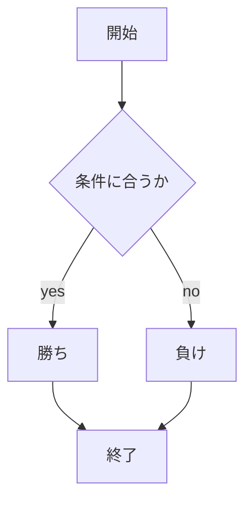
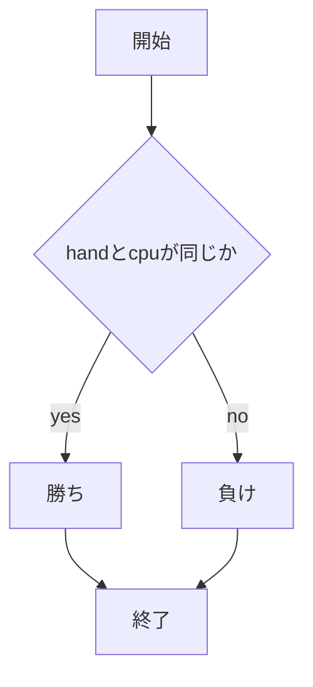

# webpro_06
2024年　10月29日
##　このプログラムについて
## ファイル一覧

ファイル名 | 説明
-|-
app5.js | プログラム本体
public/janken.html | じゃんけんの開始画面
public/suujiate.html | 数字当てゲームの開始画面
public/attimuitehoi.html | あっち向いてホイの開始画面
views/janken.ejs | じゃんけんのテンプレートファイル
views/suujiate.ejs | 数字当てゲームのテンプレートファイル
views/attimuitehoi.ejs | あっち向いてホイのテンプレートファイル


```javascript
console.log( 'Hello' );
```

## github

1. $ git add .
1. $ git commit -am 'コメント'
1. $ git push

## じゃんけんの使用方法
1. ```node app5.js``` を起動する
1. Webブラウザでlocalhost:8080/public/jankenにアクセスする
1. 自分の手を入力する




## 数字当てゲームの使用方法
1. ```node app5.js``` を起動する
1. Webブラウザでlocalhost:8080/public/suujiateにアクセスする
1. 1~10の数字を選んで入力する




## あっち向いてホイの使用方法
1. ```node app5.js``` を起動する
1. Webブラウザでlocalhost:8080/public/attimuitehoiにアクセスする
1. みぎ，ひだり，うえ，した，の中から入力する


